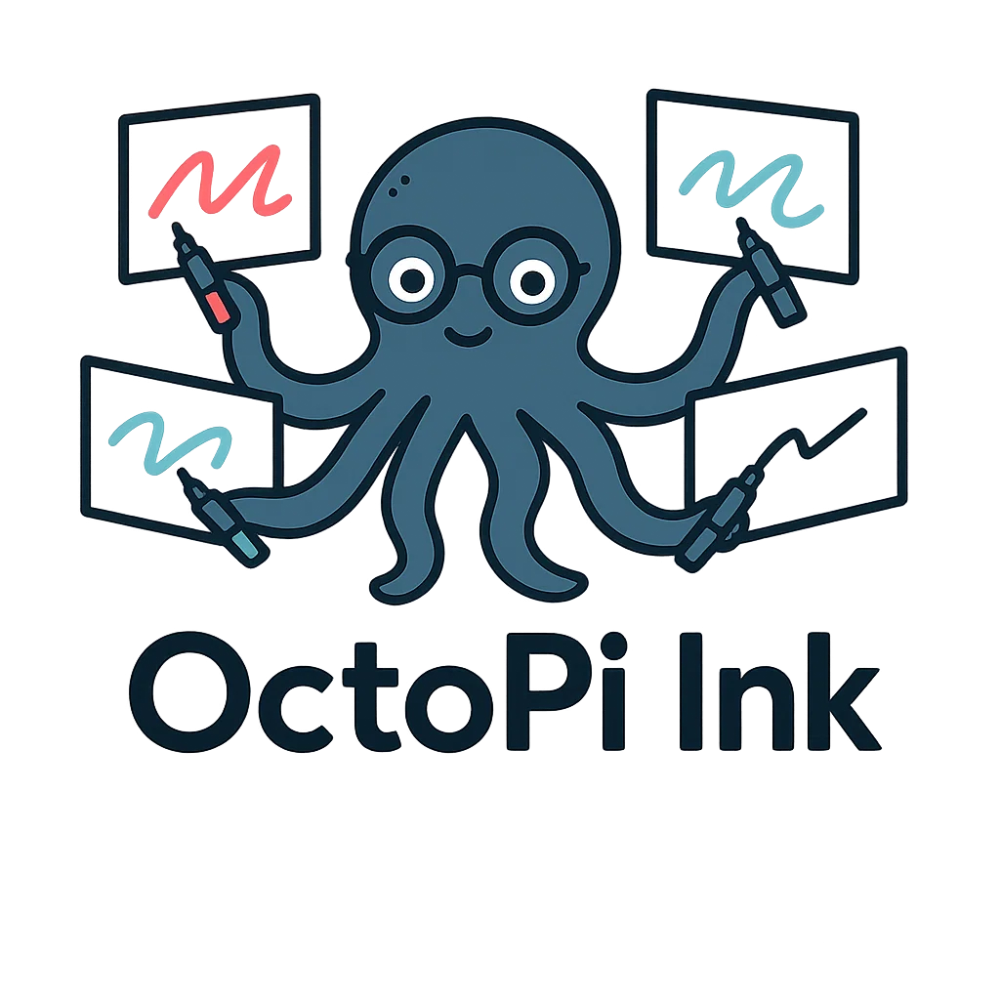

# OctoPi Ink - Collaborative Whiteboard Platform



A modern, collaborative whiteboard application designed for educational environments. Built with React, TypeScript, and Konva.js for high-performance canvas interactions.

## 🎯 Purpose

OctoPi Ink enables real-time collaborative drawing and annotation in classroom settings. Teachers can create sessions, monitor student work, and facilitate interactive learning through shared digital whiteboards.

## ✨ Key Features

- **Real-time Collaboration**: Multiple users can draw simultaneously with live synchronization
- **Advanced Input Support**: Stylus support with palm rejection for natural drawing
- **Session Management**: Teachers create sessions, students join via unique URLs
- **Multi-board Monitoring**: Teachers can view all student boards in a grid layout
- **Professional Tools**: Pencil, highlighter, eraser, and selection tools
- **Cross-platform**: Works on tablets, laptops, and interactive whiteboards

## 🏗️ Architecture Overview

### Core Technologies
- **Frontend**: React 18 + TypeScript + Vite
- **Canvas**: Konva.js for high-performance 2D graphics
- **Backend**: Supabase (PostgreSQL + Realtime)
- **Styling**: Tailwind CSS + shadcn/ui components
- **State Management**: Custom hooks with React state

### Application Structure

```
src/
├── components/           # React components organized by feature
│   ├── canvas/          # Canvas-specific components (renderers, selection)
│   ├── session/         # Session management (teacher/student views)
│   ├── auth/           # Authentication components
│   └── ui/             # Reusable UI components (shadcn/ui)
├── hooks/              # Custom React hooks for state and logic
│   ├── eventHandling/  # Input event management
│   ├── shared/         # Collaborative state management
│   └── session/        # Session-specific hooks
├── types/              # TypeScript type definitions
├── utils/              # Utility functions and helpers
└── contexts/           # React context providers
```

## 🎨 Key Concepts

### Event Handling Strategy
The application uses a sophisticated dual-event system:

1. **Pointer Events** (Primary): Used when palm rejection is enabled
   - Provides access to pressure, tilt, and contact size
   - Essential for distinguishing stylus from palm touches
   - Supported on modern devices with advanced digitizers

2. **Touch/Mouse Events** (Fallback): Used when pointer events unavailable
   - Standard touch handling for basic drawing
   - Mouse support for desktop environments
   - Ensures compatibility across all devices

### State Management
- **Local State**: Individual whiteboard state (lines, images, selections)
- **Sync State**: Real-time collaboration through Supabase realtime
- **History State**: Undo/redo functionality with operation tracking
- **Session State**: Classroom management and participant tracking

### Tool System
- **Pencil**: Standard drawing with pressure sensitivity
- **Highlighter**: Semi-transparent overlay drawing
- **Eraser**: Path-based removal of drawn content
- **Select**: Object selection, transformation, and manipulation

## 🚀 Getting Started

### Prerequisites
- Node.js 18+ and npm
- Supabase account (for collaboration features)

### Installation

```bash
# Clone the repository
git clone <YOUR_GIT_URL>
cd <YOUR_PROJECT_NAME>

# Install dependencies
npm install

# Start development server
npm run dev
```

### Environment Setup
Create a `.env.local` file with your Supabase credentials:

```env
VITE_SUPABASE_URL=your_supabase_url
VITE_SUPABASE_ANON_KEY=your_supabase_anon_key
```

## 👩‍🏫 Usage

### For Teachers
1. **Sign up/Login** on the dashboard
2. **Create Session** with student list and session details
3. **Share URL** with students for joining
4. **Monitor Progress** through the student board grid
5. **End Session** when complete

### For Students
1. **Join Session** using the provided URL
2. **Enter Name** and start drawing
3. **Collaborate** in real-time with classmates
4. **See Updates** from teacher and other students instantly

## 🔧 Development

### Component Development
Components are organized by feature and responsibility:

- **Canvas Components**: Handle drawing, rendering, and user interaction
- **Session Components**: Manage classroom functionality and user flows
- **UI Components**: Reusable interface elements from shadcn/ui

### Hook Development
Custom hooks follow a clear pattern:

- **State Hooks**: Manage specific pieces of application state
- **Event Hooks**: Handle user input and system events
- **Integration Hooks**: Connect to external services (Supabase)

### Adding New Features

1. **Define Types**: Add TypeScript interfaces in `src/types/`
2. **Create Hooks**: Build state management in `src/hooks/`
3. **Build Components**: Create UI components in `src/components/`
4. **Add Routes**: Update routing in `src/App.tsx`

### Performance Considerations

- **Canvas Optimization**: Konva.js provides hardware acceleration
- **Event Efficiency**: Debounced updates and optimized event handling
- **Memory Management**: Proper cleanup of event listeners and subscriptions
- **Network Optimization**: Only sync incremental changes, not full state

## 🤝 Contributing

### Code Style
- **TypeScript**: Strict mode enabled with comprehensive type checking
- **ESLint**: Configured for React and TypeScript best practices
- **Prettier**: Consistent code formatting
- **Conventional Commits**: Structured commit messages

### Testing
```bash
# Run type checking
npm run type-check

# Run linting
npm run lint

# Build for production
npm run build
```

## 📚 API Reference

### Core Hooks

#### `useWhiteboardState()`
Main hook for whiteboard functionality. Returns state and operations for drawing, selecting, and managing canvas content.

#### `useSharedWhiteboardState(syncConfig)`
Collaborative whiteboard with real-time synchronization. Includes all features of `useWhiteboardState` plus collaboration.

#### `useStageEventHandlers(props)`
Coordinates all input events (pointer, touch, mouse) for the canvas. Handles complex event system selection and palm rejection.

### Components

#### `<Whiteboard />`
Standalone whiteboard component for individual use.

#### `<SyncWhiteboard syncConfig={...} />`
Collaborative whiteboard component with real-time features.

#### `<TeacherView activeSession={...} />`
Complete teacher interface with session management and student monitoring.

## 🐛 Troubleshooting

### Common Issues

**Palm rejection not working**: Ensure device supports pointer events and palm rejection is enabled in settings.

**Sync not updating**: Check Supabase connection and realtime subscription status.

**Performance issues**: Verify hardware acceleration is enabled and reduce canvas resolution if needed.

**Touch not working**: Fallback touch events should activate automatically - check console for event system logs.

## 📄 License

This project is built with Lovable and deployed on Lovable's platform.

## 🔗 Links

- **Live Demo**: [Your deployment URL]
- **Lovable Project**: https://lovable.dev/projects/79a06f7b-6e0c-407e-b4cc-9aa0b952ddfd
- **Documentation**: See `docs/` folder for detailed technical documentation

---

*Built with ❤️ using Lovable, React, and modern web technologies*
